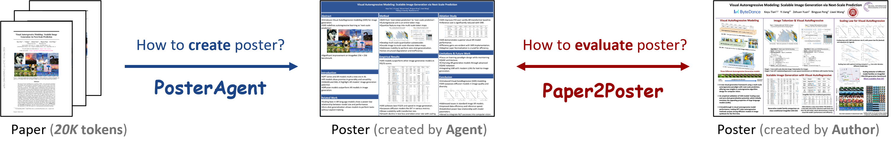
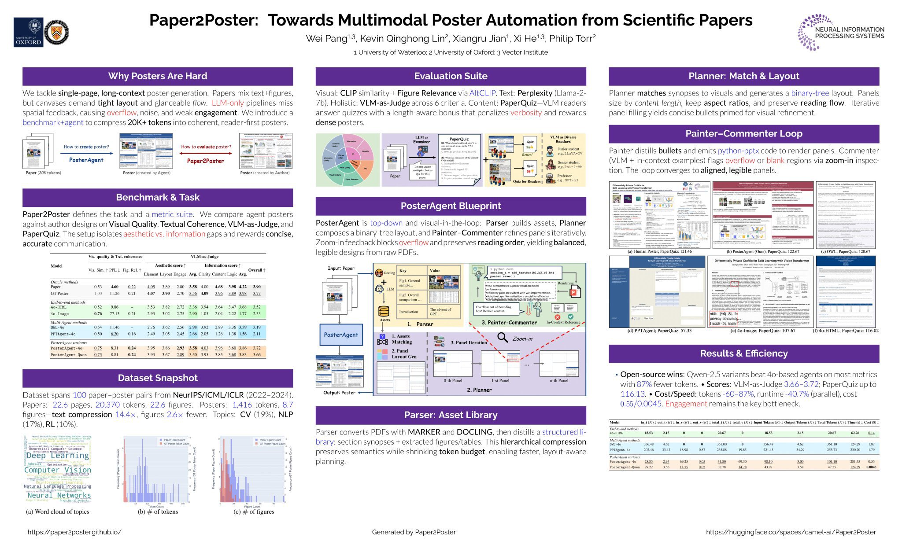
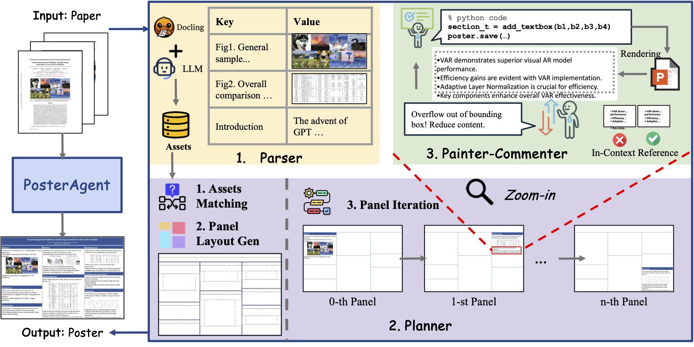
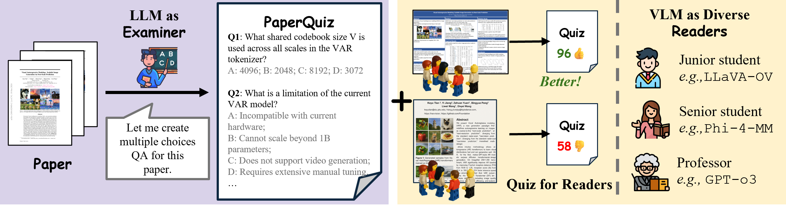

# 🎓Paper2Poster: Multimodal Poster Automation from Scientific Papers
# 从学术论文自动生成学术海报


<p align="center">
  <a href="https://arxiv.org/abs/2505.21497" target="_blank"></a>
  <a href="https://paper2poster.github.io/" target="_blank"></a>
  <a href="https://huggingface.co/datasets/Paper2Poster/Paper2Poster" target="_blank"></a>
  <a href="https://huggingface.co/papers/2505.21497" target="_blank"></a>
  <a href="https://x.com/_akhaliq/status/1927721150584390129" target="_blank"></a>
  <a href="https://huggingface.co/spaces/camel-ai/Paper2Poster" target="_blank">  </a>
</p>


## 🚀 Windows Compatibility & Optimization Version

This fork provides critical updates to ensure the pipeline runs smoothly on **Windows 11** environments. Key improvements include:

- **Windows Path & URI Fixes**: Resolved issues where Windows-style backslashes and drive letters (e.g., `H:\`) caused crashes during directory creation. Fixed the `file:///` URI formatting logic required for LibreOffice headless conversion on Windows.
- **Workflow Stability (Disabled AI Commenter)**: Removed the `ablation_no_commenter` bottleneck. By bypassing the visual feedback loop that frequently triggered API 400 errors or timeouts, the generation process is now significantly faster and more reliable.
- **Enhanced Argument Support**: Added missing CLI arguments for `--bullet_font_size` and `--section_title_font_size`, allowing users to fine-tune layout density directly from the command line without modifying source code.
- **Typography & Layout Tuning**: Optimized default font scales for large-format (e.g., 36"x48") posters to prevent text overflow and overlapping, which were prevalent in the original layout engine.
- **Custom Branding Assets**: Integrated local directory support for institutional logos and custom photography watermarks.

## 🚀 Windows 适配增强版 (Modified Version)

本项目针对原仓库在 Windows 环境下的运行瓶颈进行了深度适配与优化，主要修改如下：

1.  **Windows 路径与 URI 适配**：修复了 LibreOffice 在 Windows 下将本地路径转换为 `file:///` URI 时的编码报错，解决了 `\n` 等转义字符导致的路径识别歧义。
2.  **流程优化 - 禁用 AI 检查员**：移除了原流程中容易导致 API 400 报错或超时的 `PosterAgent/check_comment.py` 步骤，显著提升了生成海报的成功率与响应速度。
3.  **视觉资产定制**：针对 48 英寸大型海报，对部分文本字号（如正文、图表说明）进行了精简与排版优化（默认 14pt），确保物理打印时的阅读舒适度。
4.  **环境配置优化**：修正了 `argparse` 参数传递缺失的问题，并更新了 `requirements.txt` 以适配 Windows 端的依赖包。


---
**Note:** The sections below are from the original author's repository.
**注意：** 以下内容来自原作者的代码仓库说明。
---


We address **How to create a poster from a paper** and **How to evaluate poster.**




## 🤩 Paper2Poster for Paper2Poster



## 🔥 Update
- [x] [2025.11.3] Added **Gradio demo** support.
- [x] [2025.10.18] Added **Docker** support.
- [x] [2025.10.13] Added automatic **logo support** for conferences and institutions, **YAML-based style customization**, a new default theme.
- [x] [2025.9.18] Paper2Poster has been accepted to **NeurIPS 2025 Dataset and Benchmark Track**.
- [x] [2025.9.3]  We now support generate per section content in **parallel** for faster generation, by simply specifying `--max_workers`.
- [x] [2025.5.27] We release the [arXiv](https://arxiv.org/abs/2505.21497), [code](https://github.com/Paper2Poster/Paper2Poster) and [`dataset`](https://huggingface.co/datasets/Paper2Poster/Paper2Poster)

<!--## 📚 Introduction-->

**PosterAgent** is a top-down, visual-in-the-loop multi-agent system from `paper.pdf` to **editable** `poster.pptx`.



<!--A Top-down, visual-in-the-loop, efficient multi-agent pipeline, which includes (a) Parser distills the paper into a structured asset library; the (b) Planner aligns text–visual pairs into a binary‐tree layout that preserves reading order and spatial balance; and the (c) Painter-Commentor loop refines each panel by executing rendering code and using VLM feedback to eliminate overflow and ensure alignment.-->

<!---->

<!--**Paper2Poster:** A benchmark for paper to poster generation, paired with human generated poster, with a comprehensive evaluation suite, including metrics like **Visual Quality**, **Textual Coherence**, **VLM-as-Judge** and **PaperQuiz**. Notably, PaperQuiz is a novel evaluation which assume A Good poster should convey core paper content visually.-->

## 📋 Table of Contents

<!--- [📚 Introduction](#-introduction)-->
- [🛠️ Installation](#-installation)
- [🐳 Docker Deployment](#-docker-deployment)
- [🚀 Quick Start](#-quick-start)
- [🔮 Evaluation](#-evaluation)
---

## 🛠️ Installation
Our Paper2Poster supports both local deployment (via [vLLM](https://docs.vllm.ai/en/v0.6.6/getting_started/installation.html)) or API-based access (e.g., GPT-4o).

**Python Environment**
```bash
pip install -r requirements.txt
```

**Install Libreoffice**
```bash
sudo apt install libreoffice
```

or, if you do **not** have sudo access, download `soffice` executable directly: https://www.libreoffice.org/download/download-libreoffice/, and add the executable directory to your `$PATH`.

**Install poppler**
```bash
conda install -c conda-forge poppler
```

**API Key**

Create a `.env` file in the project root and add your OpenAI API key:

```bash
OPENAI_API_KEY=<your_openai_api_key>
```

**Optional: Google Search API (for logo search)**

To use Google Custom Search for more reliable logo search, add these to your `.env` file:

```bash
GOOGLE_SEARCH_API_KEY=<your_google_search_api_key>
GOOGLE_SEARCH_ENGINE_ID=<your_search_engine_id>
```

---

## 🐳 Docker Deployment

For easier deployment, you can use Docker to run Paper2Poster without manual dependency installation.

**Build the Docker image:**
```bash
docker build -t paper2poster .
```

**Troubleshooting:**
- If you get a "permission denied" error when running Docker commands, use `sudo` before Docker commands (e.g., `sudo docker build -t paper2poster .`)

**Example:**
```bash
# Create output directory if it doesn't exist
mkdir -p <4o_4o>_generated_posters

docker run --rm \
-e OPENAI_API_KEY=<your_openai_api_key> \
-v "$(pwd)/Paper2Poster-data:/Paper2Poster-data" \
-v "$(pwd)/<4o_4o>_generated_posters:/app/<4o_4o>_generated_posters" \
paper2poster \
python -m PosterAgent.new_pipeline \
--poster_path="/Paper2Poster-data/<paper_name>/paper.pdf" \
--model_name_t=4o \
--model_name_v=4o \
--poster_width_inches=48 \
--poster_height_inches=36
```

The generated poster will be saved in `<4o_4o>_generated_posters/Paper2Poster-data/paper_name/poster.pptx` on your host machine.

---

## 🚀 Quick Start
Create a folder named `{paper_name}` under `{dataset_dir}`, and place your paper inside it as a PDF file named `paper.pdf`.
```
📁 {dataset_dir}/
└── 📁 {paper_name}/
    └── 📄 paper.pdf
```
To use open-source models, you need to first deploy them using [vLLM](https://docs.vllm.ai/en/v0.6.6/getting_started/installation.html), ensuring the port is correctly specified in the `get_agent_config()` function in [`utils/wei_utils.py`](utils/wei_utils.py).

- [High Performance] Generate a poster with `GPT-4o`:

```bash
python -m PosterAgent.new_pipeline \
    --poster_path="${dataset_dir}/${paper_name}/paper.pdf" \
    --model_name_t="4o" \  # LLM
    --model_name_v="4o" \  # VLM
    --poster_width_inches=48 \
    --poster_height_inches=36
```

- [Economic] Generate a poster with `Qwen-2.5-7B-Instruct` and `GPT-4o`:

```bash
python -m PosterAgent.new_pipeline \
    --poster_path="${dataset_dir}/${paper_name}/paper.pdf" \
    --model_name_t="vllm_qwen" \  # LLM
    --model_name_v="4o" \         # VLM
    --poster_width_inches=48 \
    --poster_height_inches=36 \
    --no_blank_detection          # An option to disable blank detection
```

- [Local] Generate a poster with `Qwen-2.5-7B-Instruct`:

```bash
python -m PosterAgent.new_pipeline \
    --poster_path="${dataset_dir}/${paper_name}/paper.pdf" \
    --model_name_t="vllm_qwen" \           # LLM
    --model_name_v="vllm_qwen_vl" \        # VLM
    --poster_width_inches=48 \
    --poster_height_inches=36
```

PosterAgent **supports flexible combination of LLM / VLM**, feel free to try other options, or customize your own settings in `get_agent_config()` in [`utils/wei_utils.py`](utils/wei_utils.py).

### Adding Logos to Posters

You can automatically add institutional and conference logos to your posters:

```bash
python -m PosterAgent.new_pipeline \
    --poster_path="${dataset_dir}/${paper_name}/paper.pdf" \
    --model_name_t="4o" \
    --model_name_v="4o" \
    --poster_width_inches=48 \
    --poster_height_inches=36 \
    --conference_venue="NeurIPS"  # Automatically searches for conference logo
```

**Logo Search Strategy:**
1. **Local search**: First checks the provided logo store (`logo_store/institutes/` and `logo_store/conferences/`)
2. **Web search**: If not found locally, performs online search
   - By default, uses DuckDuckGo (no API key required)
   - For more reliable results, use `--use_google_search` (requires `GOOGLE_SEARCH_API_KEY` and `GOOGLE_SEARCH_ENGINE_ID` in `.env`)

You can also specify custom logo paths to skip auto-detection:
```bash
--institution_logo_path="path/to/institution_logo.png" \
--conference_logo_path="path/to/conference_logo.png"
```

### YAML Style Customization

Customize poster appearance via YAML configuration files:
- **Global defaults**: `config/poster.yaml` (applies to all posters)
- **Per-poster override**: Place `poster.yaml` next to your `paper.pdf` for custom styling


## 🔮 Evaluation
Download Paper2Poster evaluation dataset via:
```bash
python -m PosterAgent.create_dataset
```

In evaluation, papers are stored under a directory called `Paper2Poster-data`.

To evaluate a generated poster with **PaperQuiz**:
```bash
python -m Paper2Poster-eval.eval_poster_pipeline \
    --paper_name="${paper_name}" \
    --poster_method="${model_t}_${model_v}_generated_posters" \
    --metric=qa # PaperQuiz
```

To evaluate a generated poster with **VLM-as-Judge**:
```bash
python -m Paper2Poster-eval.eval_poster_pipeline \
    --paper_name="${paper_name}" \
    --poster_method="${model_t}_${model_v}_generated_posters" \
    --metric=judge # VLM-as-Judge
```

To evaluate a generated poster with other statistical metrics (such as visual similarity, PPL, etc):
```bash
python -m Paper2Poster-eval.eval_poster_pipeline \
    --paper_name="${paper_name}" \
    --poster_method="${model_t}_${model_v}_generated_posters" \
    --metric=stats # statistical measures
```

If you want to create a PaperQuiz for your own paper:
```bash
python -m Paper2Poster-eval.create_paper_questions \
    --paper_folder="Paper2Poster-data/${paper_name}"
```

## ❤ Acknowledgement
We extend our gratitude to [🐫CAMEL](https://github.com/camel-ai/camel), [🦉OWL](https://github.com/camel-ai/owl), [Docling](https://github.com/docling-project/docling), [PPTAgent](https://github.com/icip-cas/PPTAgent) for providing their codebases.

## 📖 Citation

Please kindly cite our paper if you find this project helpful.

```bibtex
@misc{paper2poster,
      title={Paper2Poster: Towards Multimodal Poster Automation from Scientific Papers}, 
      author={Wei Pang and Kevin Qinghong Lin and Xiangru Jian and Xi He and Philip Torr},
      year={2025},
      eprint={2505.21497},
      archivePrefix={arXiv},
      primaryClass={cs.CV},
      url={https://arxiv.org/abs/2505.21497}, 
}
```
